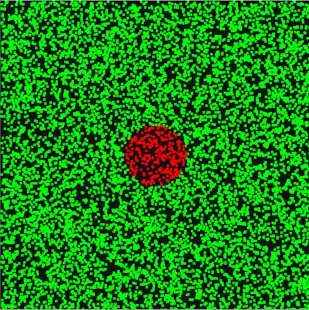

# dart-board

Simple (and probably not too accurate) [Monte Carlo Simulation](https://en.wikipedia.org/wiki/Monte_Carlo_method) to answer a not so simple question: "What's the probability of randomly hitting a bullseye; assuming all our darts are hitting the board, plus some extra, rectangular, space around it."



## Build
Remember to change the variable `MSVC_PATH` in `build.bat` file accordingly

```console
> build.bat
```

## Instruction
`ESC` - exit\
`R` - generate new set of points

## Notes
- We are using an awesome implementation of [Mersenne Twister](https://en.wikipedia.org/wiki/Mersenne_Twister) by [cslarsen](https://github.com/cslarsen/mersenne-twister), thank you so much.